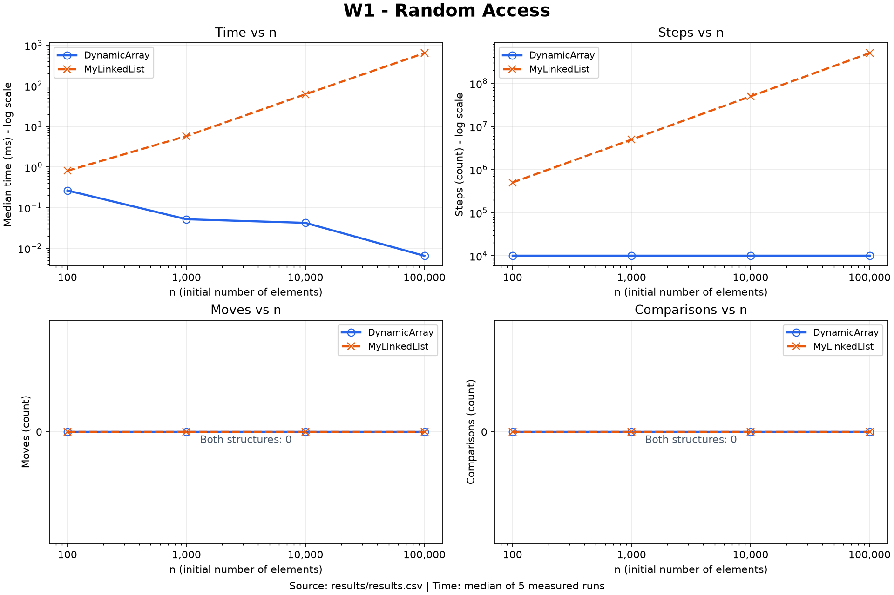
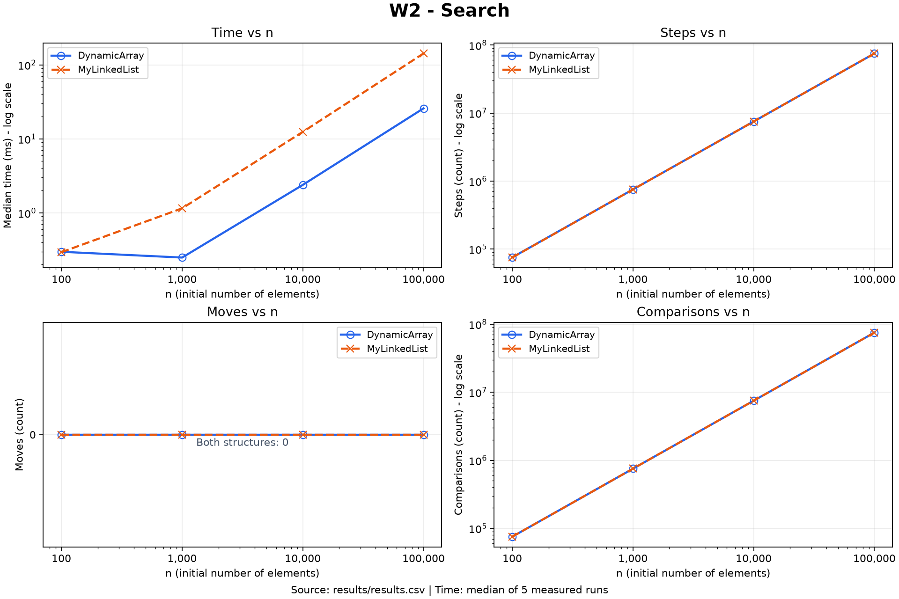
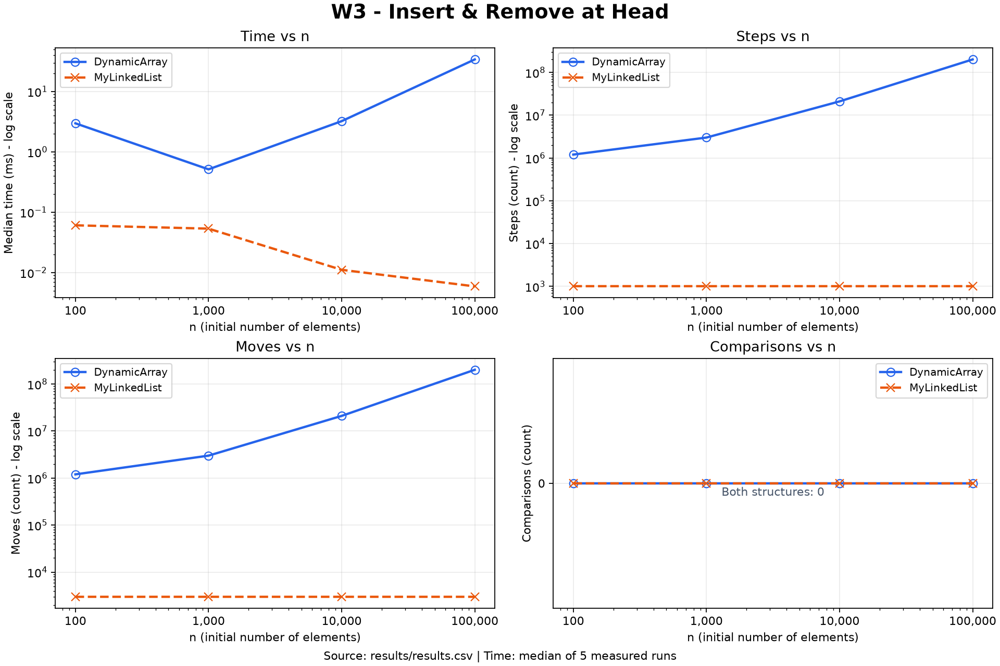
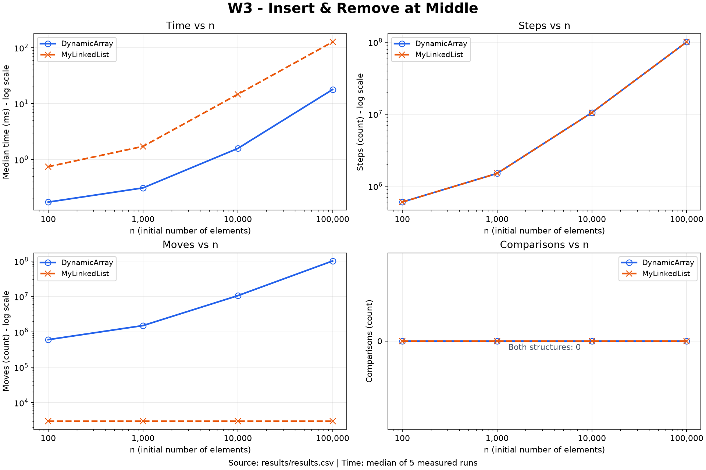
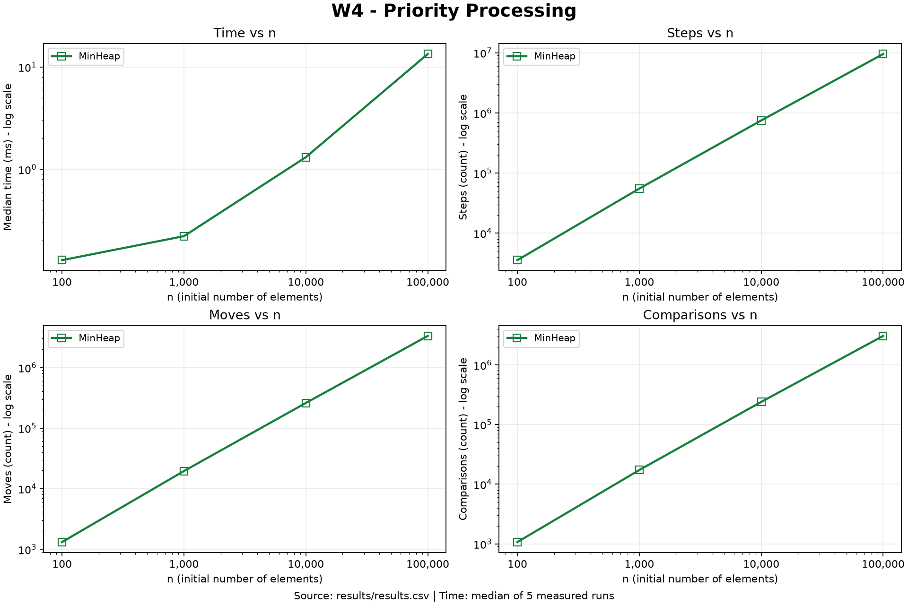

# Assignment 2 - Data Structures

## Implementation Overview

DynamicArray and MinHeap store primitive values in `int[]` buffers with initial
capacity 10 and doubling growth. MyLinkedList uses its own singly linked nodes
with `int value`, `next`, `head` and `tail`. Sequence methods validate indexes;
empty-heap access throws `IllegalStateException`. Java collections are used
only as test references. The Gradle project targets Java 17 and has 49 JUnit 5
tests, including reference comparisons, heap-property checks and exact metrics.

Every structure owns a Metrics object with `long` counters updated at actual
operation sites. A step is an array-cell read or following a `next` link,
including a null successor; a move is relocating an existing array element or
assigning a structural link (`head`, `tail`, `next`); a comparison compares
element values. Bounds checks, pointer comparisons, new-int writes, local
assignments and clearing unused array cells are excluded. A heap swap counts
two array reads and two moves, while a comparison of two array elements counts
two reads and one comparison. Resetting counters does not change stored data.

## Complexity Analysis

Let `n` be the number of stored elements before an operation and `i` a valid index.
The tables describe successful operations; invalid indexes and empty-heap access
throw an exception in Θ(1) time. Bounds concern algorithmic work, excluding JVM
garbage collection and operating-system scheduling. Allocating and initializing
an array of length proportional to `n` takes Θ(n) time.

Θ denotes a tight bound, O an upper bound, and Ω a lower bound. For example, a
full unsuccessful linear search takes both O(n) and Ω(n), hence Θ(n).
Expressions involving logarithms use `log(n + 1)` to cover small heaps.

Average indexed-operation costs assume a uniformly selected valid index.
Average search costs assume either a successful search with a uniformly
distributed first matching position or an unsuccessful search; both give Θ(n).
For operations that grow an array, the average column explicitly gives an
amortized bound over a sequence starting from an empty structure, rather than
assuming a probability that the array is full. Heap value distributions are
unspecified, so its average entries are upper bounds rather than tight expected
costs for a particular distribution.

Auxiliary space means additional memory needed during an operation, excluding
the existing structure. A newly allocated array counts during resizing because
the old and new arrays coexist while elements are copied. All methods are
iterative; metrics use a constant number of `long` fields.

### DynamicArray

| Operation | Best time | Average / amortized time | Worst time | Auxiliary space |
| --- | --- | --- | --- | --- |
| `add(x)` | Θ(1) | Θ(1) amortized | Θ(n) | Θ(1) without resize; Θ(n) with resize |
| `add(i, x)` | Θ(1) | Θ(n) for a uniform insertion index | Θ(n) | Θ(1) without resize; Θ(n) with resize |
| `remove(i)` | Θ(1) | Θ(n) | Θ(n) | Θ(1) |
| `get(i)` | Θ(1) | Θ(1) | Θ(1) | Θ(1) |
| `contains(x)` | Θ(1) | Θ(n) | Θ(n) | Θ(1) |

Appending with spare capacity writes the new element and increments `size`, so
the normal case is Θ(1). When full, `ensureCapacity()` allocates an array twice
as large and copies all `n` elements, giving a Θ(n) resize case. With initial
capacity 10, copied capacities form the geometric series `10 + 20 + 40 + ...`.
Across `m` appends starting empty, total copying and array initialization cost
O(m); the `m` new-element writes also give Ω(m). Total work is therefore Θ(m),
and each append costs Θ(1) amortized, despite individual Θ(n) resizes.

Indexed insertion shifts exactly `n - i` elements, so it takes Θ(n - i + 1)
without resizing and Θ(n) when resizing. Its best case is insertion at `i = n`
with spare capacity. Under a uniform index in `0..n`, the expected shift count
is `n / 2`, giving Θ(n).

Removal shifts `n - i - 1` elements and takes Θ(n - i). Removing the last
element is Θ(1); removing the first is Θ(n). The array never shrinks, so removal
requires only constant additional space. Direct indexing makes `get(i)` Θ(1).
`contains(x)` stops at the first match or scans all `n` live elements: a first
match gives Θ(1), while a last match or absence gives Θ(n).

### MyLinkedList

| Operation | Best time | Average time | Worst time | Auxiliary space |
| --- | --- | --- | --- | --- |
| `add(x)` | Θ(1) | Θ(1) | Θ(1) | Θ(1), one new node |
| `add(i, x)` | Θ(1) | Θ(n) | Θ(n) | Θ(1), one new node |
| `remove(i)` | Θ(1) | Θ(n) | Θ(n) | Θ(1) |
| `get(i)` | Θ(1) | Θ(n) | Θ(n) | Θ(1) |
| `contains(x)` | Θ(1) | Θ(n) | Θ(n) | Θ(1) |

The implementation is singly linked and stores both `head` and `tail`.
Appending uses `tail` directly and updates a constant number of links, so
`add(x)` is Θ(1). Indexed insertion at `i = n` delegates to append, and insertion
at `i = 0` updates the head directly; both cases are Θ(1). For `0 < i < n`,
`nodeAt(i - 1)` follows `i - 1` links before inserting the new node, giving
Θ(i + 1). A uniformly selected insertion index still gives Θ(n) average time.

Removing the head is Θ(1). Removing any other node must first find its
predecessor, giving Θ(i + 1), including Θ(n) removal of the tail. The tail pointer
does not supply a predecessor in a singly linked list. `get(i)` follows exactly
`i` links from the head and takes Θ(i + 1); even `get(n - 1)` traverses the list
in this implementation. Search compares node values until the first match or
the end, giving the same search-time bounds as DynamicArray. Traversal uses
local references rather than an additional list or a recursion stack.

### MinHeap

| Operation | Best time | Average / amortized upper bound | Worst time | Auxiliary space |
| --- | --- | --- | --- | --- |
| `insert(x)` | Θ(1) | O(log(n + 1)) amortized; value-distribution dependent | Θ(n) with resize; Θ(log(n + 1)) worst without resize | Θ(1) without resize; Θ(n) with resize |
| `peekMin()` | Θ(1) | Θ(1) | Θ(1) | Θ(1) |
| `extractMin()` | Θ(1) | O(log(n + 1)); value-distribution dependent | Θ(log(n + 1)) | Θ(1) |

Insertion appends an element and calls `bubbleUp()`. With spare capacity and
no violated parent relation, it stops after constant work. A new smallest
element may rise through the heap's Θ(log(n + 1)) levels. This implementation
also doubles its backing array when full, so the worst individual insertion is
Θ(n), rather than O(log n). Geometric growth contributes O(1) amortized copying
and allocation cost per insertion; combining it with bubble-up gives an
O(log(n + 1)) amortized upper bound.

The minimum is stored at index 0, making `peekMin()` Θ(1). Extraction replaces
the root with the last element and calls `bubbleDown()`. Each iteration chooses
the smaller existing child and performs at most one swap, moving down one
level. The worst case visits Θ(log(n + 1)) levels. The best case stops at the
root, for example when all values are equal. No resizing or shrinking occurs
during extraction, so auxiliary space is Θ(1). Without assumptions about heap
values, a tight Θ(log n) average claim is unjustified: equal-value heaps can
perform both bubble-up and bubble-down in Θ(1).

### Storage and Metric Overhead

During growth from empty without removals, each structure uses Θ(n + 1) storage.
DynamicArray and MinHeap have geometrically grown `int[]` buffers; MyLinkedList
has one node per element plus head and tail references and retains Θ(n + 1)
storage after removals as well. The fixed initial array capacity explains the
`+1` for empty arrays. Arrays retain their capacity after removals, so after
shrinking the logical size their storage is Θ(c), where `c` is the retained
capacity, not necessarily Θ(n + 1). Each structure's Metrics object uses Θ(1) space, and each
counter update adds Θ(1) work at its operation site without changing any of
the asymptotic bounds above.

## Loop Invariant Proof 1 - DynamicArray.contains

The actual loop is `for (int i = 0; i < size; i++)`. Each iteration compares
`data[i]` with the requested value `x`, returning `true` on equality.

### Invariant

Before each evaluation of the loop condition, `0 <= i <= size`, and every live
element in the already examined prefix `data[0..i)` differs from `x`:
for every integer `j` with `0 <= j < i`, `data[j] != x`. The live array contents
and `size` remain unchanged throughout the search.

### Initialization

Initially `i = 0`, so the examined prefix is empty. The assertion about its
elements is vacuously true, and `0 <= i <= size` holds even for an empty array.
No array contents or size have been changed.

### Maintenance

If `i < size`, the current array access is valid. When `data[i] == x`, the
method returns `true` with an actual matching live element as its witness.
Otherwise, `data[i] != x`. Together with the invariant for `data[0..i)`, this
proves that all elements of `data[0..i + 1)` differ from `x`. The loop increments
`i`, preserving the invariant for the next condition check. Counter updates
change only Metrics fields, not the searched array or its size.

### Termination

Each non-returning iteration decreases the nonnegative quantity `size - i`
by one. The method therefore either returns on a match or reaches `i = size`.
At normal loop exit, the invariant says that all live elements `data[0..size)`
differ from `x`, so returning `false` is correct. For an empty array, the loop
is skipped and the same argument applies.

### Conclusion

`contains(x)` returns `true` if and only if a live element equals `x`, without
changing the stored sequence. Duplicate and negative values do not affect the
proof because it relies only on equality comparisons.

## Loop Invariant Proof 2 - MinHeap.bubbleDown

This proof concerns the actual call `bubbleDown(0)` from `extractMin()`, after
the original root has been saved, the last element has replaced it, and `size`
has been decreased. The call occurs only when the remaining heap is nonempty.
For each live non-root node `c`, its parent is `(c - 1) / 2`. A heap edge is
ordered when its parent value is at most its child value.

### Invariant

Before each evaluation of `while (index < size / 2)`:

1. `index` is a live node, and all heap edges are ordered except possibly the
   edges from `index` to its immediate children. Thus each child subtree of
   `index` is already a min heap.
2. If `index` has a parent, that parent's value is at most every value in the
   subtree rooted at `index`, including the value at `index` itself.
3. `size` and the multiset of live values are unchanged by bubble-down.

The second assertion ensures that promoting a child cannot create a new
violation above the current node.

### Initialization

Deleting the last leaf leaves all surviving edges of the original heap ordered.
Replacing the root changes only its outgoing edges, so any violations are
confined to the root and its children. Initially `index = 0` has no parent,
making the second assertion vacuously true. Bubble-down has not yet changed
any value or the remaining size, establishing the third assertion.

### Maintenance

The loop condition identifies exactly nodes with at least a left child.
The code chooses the smaller existing child, using the left child when their
values tie. Let `x` be the current value and `y` the chosen child's value.
If `x <= y`, then `x` is at most both existing children, and the loop breaks
with all edges ordered.

Otherwise `y < x`, and the code swaps these values. The old current position
now contains `y`, which is at most `x` and the other child's root, if present.
Its incoming edge remains ordered because the invariant's second assertion
bounds its previous parent's value by `y`. All edges outside these positions
remain unchanged.

The chosen child subtree was a min heap before the swap, so its old root `y`
was at most every value below it. After the swap, `y` is also less than the
replacement value `x`. Setting `index` to that child therefore establishes
the second assertion at the new position. Only edges from this new position
to its own children may now be violated, establishing the first assertion.
The swap preserves the live multiset and size, establishing the third.

### Termination

Each swapping iteration moves `index` one level down a finite binary tree;
the number of levels remaining to a deepest descendant strictly decreases.
The loop must therefore stop either by a break or when `index` is a leaf.
On a break, the current value is at most the smaller child and hence both
children. At a leaf there are no outgoing edges to violate. In either case,
the invariant proves that every live heap edge is ordered.

### Conclusion

`bubbleDown(0)` restores the min-heap property without losing or duplicating
any remaining value. Since the saved original root was a minimum of the
original heap, `extractMin()` returns a correct minimum and leaves a valid
heap containing exactly the other elements. When extraction leaves size zero,
bubble-down is skipped and the empty heap already satisfies the property.

## Benchmark Methodology

The source of every reported measurement is [results/results.csv](results/results.csv),
produced by the Gradle `benchmark` task. The captured verification run used
Windows, an Intel Core i5-14400F and Temurin OpenJDK 17.0.20.1; hardware and JVM
configuration affect elapsed times. The runner executes the cases in one JVM,
with sizes 100, 1,000, 10,000 and 100,000. Each workload starts its own
`Random(42)`, and compared structures receive exactly the same generated input.
Search inputs are nonnegative, with absent queries chosen from negative values;
500 present and 500 absent queries alternate, including first-occurrence handling
when the input contains duplicates.

Every case uses a fresh structure for one discarded warm-up and each of five
measured runs. Timing uses `System.nanoTime()`; the five durations are sorted
and the middle duration is converted to milliseconds. Warm-up durations and
counters are not exported. Reported counters describe one measured run, not a
sum over repetitions: identical inputs produce identical counts. W1 and W2
check exact expected counters; W3 and W4 also check count consistency across
runs. Expected counts are validation only; CSV values come from Metrics.

Random generation, reference preparation, allocation of answer buffers, result
validation, console output and CSV writing are outside the timed sections.
W1-W3 exclude initial filling and reset metrics immediately before their
operation loops. W4 starts with an empty heap and measures all n insertions
and n extractions, including insertion-driven resizing. Answer-buffer writes
and checksum accumulation remain inside the loops to preserve observable results.

| Workload | Measured operations |
| --- | --- |
| W1 | 10,000 random valid `get(index)` calls |
| W2 | 1,000 `contains(x)` calls, half present and half absent |
| W3 head | 1,000 insertions at index 0, followed by 1,000 removals there |
| W3 middle | 1,000 insertions at current `size / 2`, followed by 1,000 removals at current `size / 2` |
| W4 | n inserts followed by n minimum extractions |

W1 checks the accumulated result against an input-derived checksum. W2 checks
every boolean answer. W3 checks all removed values, final size and complete
remaining contents against an independent primitive-array simulation, capturing
counters before verification touches the structure. W4 checks non-decreasing
order, equality to a sorted input copy and an empty final heap. A failed check
throws an exception instead of exporting a new result set.

This is a small educational benchmark with instrumented operations, one warm-up
per case and no separate JVM forks. Shared-JVM compilation, scheduling and
allocation effects can still influence timings, especially very short cases.
The observed decrease in some small-operation timings as n increases is not
evidence that their asymptotic cost decreases. No cache-miss or GC-pause counters
were recorded, so explanations about those effects are interpretations rather
than measurements. Re-running `benchmark` changes timings; regenerate plots
and update these tables together when replacing the saved CSV.

## Results

Times below are median milliseconds, rounded to six decimal places as in the
CSV. The five linked charts show all four metrics at all sizes; each pair of
compared structures is plotted together. Zero-valued counters are displayed
explicitly, and logarithmic scales are labelled.

### W1 - Random Access

| n | DynamicArray time (ms) | MyLinkedList time (ms) | DynamicArray steps | MyLinkedList steps |
| --- | --- | --- | --- | --- |
| 100 | 0.239400 | 0.812400 | 10000 | 501327 |
| 1000 | 0.052600 | 5.589301 | 10000 | 4961776 |
| 10000 | 0.042099 | 60.275600 | 10000 | 49998943 |
| 100000 | 0.005401 | 658.971500 | 10000 | 502391623 |

Both structures have zero moves and zero value comparisons for this workload.
The array performs one read per query; the list follows a number of links
equal to the queried index.

### W2 - Search

| n | DynamicArray time (ms) | MyLinkedList time (ms) | Comparisons per structure |
| --- | --- | --- | --- |
| 100 | 0.298301 | 0.294400 | 75375 |
| 1000 | 0.249201 | 1.152100 | 752679 |
| 10000 | 2.390400 | 12.433300 | 7506930 |
| 100000 | 25.822800 | 142.404900 | 75203654 |

Moves are zero. Array steps equal comparisons; list steps equal comparisons
minus 500 because each successful search returns before following the matching
node's next link.

### W3 - Insert & Remove

#### Head

| n | DynamicArray time (ms) | MyLinkedList time (ms) | DynamicArray moves | MyLinkedList moves |
| --- | --- | --- | --- | --- |
| 100 | 2.969800 | 0.060601 | 1200120 | 3000 |
| 1000 | 0.513100 | 0.053401 | 3000280 | 3000 |
| 10000 | 3.225501 | 0.011101 | 21009240 | 3000 |
| 100000 | 33.991200 | 0.005900 | 200999000 | 3000 |

DynamicArray steps equal moves plus 1,000 reads of the removed values. The list
performs 1,000 steps for head removal and 3,000 structural-link writes for the
combined operations, independent of the initial size. Array moves include
resize copies when the workload exceeds its initially available capacity.

#### Middle

| n | DynamicArray time (ms) | MyLinkedList time (ms) | DynamicArray moves | MyLinkedList moves |
| --- | --- | --- | --- | --- |
| 100 | 0.173000 | 0.743500 | 600620 | 3000 |
| 1000 | 0.310500 | 1.715100 | 1500780 | 3000 |
| 10000 | 1.575599 | 14.657899 | 10509740 | 3000 |
| 100000 | 17.847799 | 126.492499 | 100499500 | 3000 |

Comparisons are zero for both W3 variants. At n = 100,000, both structures
record 100,500,500 steps in the middle case, despite different kinds of work:
array reads while shifting and link traversal in the list. Only link changes
count as list moves, so its small move count does not capture traversal cost.
The expected final sequence is simulated explicitly: removing at the current
middle is not assumed to undo all earlier middle insertions.

### W4 - Priority Processing

| n | MinHeap time (ms) | Steps | Moves | Comparisons |
| --- | --- | --- | --- | --- |
| 100 | 0.137499 | 3551 | 1313 | 1069 |
| 1000 | 0.225800 | 55053 | 19525 | 17264 |
| 10000 | 1.216901 | 748595 | 259675 | 239460 |
| 100000 | 9.842100 | 9539809 | 3320859 | 3059475 |

All extractions matched the sorted input. The complete workload has an
O(n log(n + 1)) upper bound, including O(n) total capacity-growth work.

## Performance Discussion

At n = 100,000, W1 uses 10,000 array reads versus 502,391,623 list-link steps,
which supports choosing DynamicArray for indexed access.
Direct `get(i)` locates an int without traversing earlier elements, although
random access does not itself guarantee sequential cache locality.
The contiguous `int[]` layout gives sequential search and shifting spatial
locality because a CPU cache line can bring nearby elements into the cache.
MyLinkedList must perform pointer chasing through separately allocated Node
objects, creating dependent loads and potentially weaker locality.
Node references, object headers and alignment can increase memory use compared
with primitive array cells, and their allocation and reclamation involve the
garbage collector even though filling is excluded from W1-W3 timings.
These cache and GC effects were not measured directly, but they are plausible
contributors to the runtime differences.
W2 performs the same 75,203,654 comparisons in each structure at n = 100,000,
yet its saved times are 25.822800 ms for the array and 142.404900 ms for the list,
showing that equal Θ(n) search complexity does not imply equal elapsed time.
For W3 head, the list's 3,000 moves and 1,000 steps stay constant while the array
makes 200,999,000 moves at n = 100,000, supporting the list for frequent head edits.
For W3 middle, both structures incur traversal or shift work proportional to n,
and the array is faster in this run despite the list's smaller move count.
A tail pointer also makes this list useful for append-heavy queues with head
removal, while indexed middle edits still require locating the predecessor.
MinHeap is appropriate when repeatedly processing the smallest priority, with
constant-time minimum lookup and logarithmic heap-order restoration apart from
occasional insertion resizing.
Its W4 result of 9.842100 ms at n = 100,000 covers both construction and complete
extraction, so it should not be compared as an identical operation mix to W1-W3.
Finally, tiny timings and non-monotonic curves reflect the limits of this shared
JVM experiment, and the reproducible operation counts are stronger evidence of
algorithmic scaling than a single machine's precise timing ratios.

## Conclusion

The implementations and proofs establish correct sequence and priority-queue
behavior, while physical counters expose why their workloads differ.
DynamicArray fits indexed access and contiguous scans, MyLinkedList fits head
edits and tail appends, and MinHeap fits repeated minimum-priority processing.
The saved CSV and charts illustrate these choices within the stated benchmark
limitations; no one structure is best for every operation mix.
